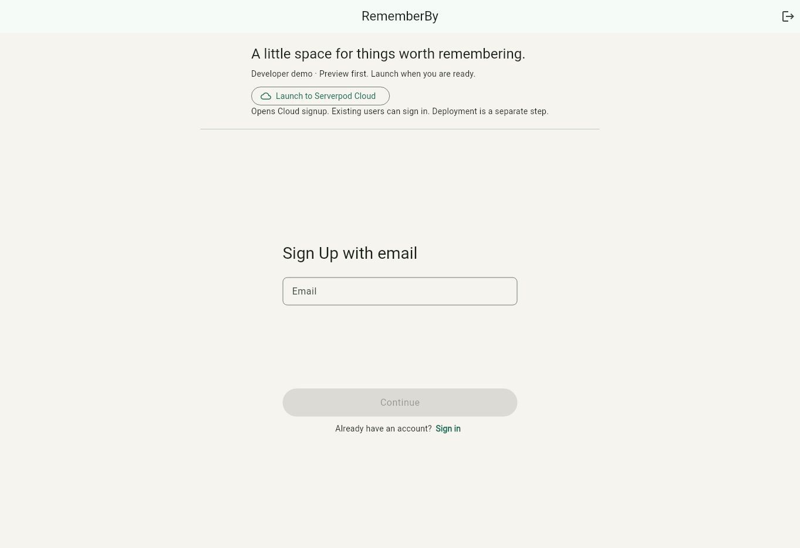

# RememberBy

**Build a real Flutter + Serverpod app from your phone — without personally operating a terminal.**

You talk to an agent. The agent operates the development environment. You use the running app.

> The commute test: Could I keep developing this while standing on a packed 8:12 train with only my phone?

RememberBy is a tiny experiment in that development loop. This is an **early tester release**, generated separately from the original private product.

[Start testing](docs/TESTER_GUIDE.md) · [See what was verified](docs/VALIDATION.md)

## The whole app

1. Sign in with email.
2. Add something you want to remember.
3. Store it in PostgreSQL through Serverpod.
4. Reload and retrieve your own items, newest first.

Flutter → generated Serverpod client → authenticated API → PostgreSQL. The backend tests cover persistence, per-user isolation, anonymous access rejection and input validation. In local development, Serverpod logs email verification codes; an agent can help you complete the preview sign-in without exposing codes in public issues or screenshots.

The simplicity is intentional. This repository is about the development loop, not the feature set.

## Preview first. Launch when ready.

The Codespace is the development machine. The agent operates it. Your phone is the control surface.

The preview uses its own development database. You can explore it before setting up a Cloud account. The app's **Launch to Serverpod Cloud** button opens the real Cloud signup page; existing users choose Sign in. Account setup, CLI authentication, project selection and deployment are separate steps.

There is no hosted-app link or one-click deployment claim in this release. Cloud signup was exercised, but the original project's launch attempt stopped at Google authentication with a 502 error before account selection. A completed Cloud deployment remains unverified.

## Make a change

Open this repository's **Code → Codespaces** menu in GitHub and create your own Codespace. Give an agent access to that environment and ask:

> Start RememberBy, run its checks and show me the private preview. Keep the preview database separate from production. Tell me what you actually verified.

Then try:

> Add due dates to remembered items. Update the database and generated client, run checks, and show me the changed preview.

Or:

> My reminders are not saving. Inspect the failing request and logs, fix it, and verify the preview.

When you are ready to deploy, specify your own Cloud account and target project. The agent should carry the change through code, database, tests, deployment and feedback, while you hold a phone.

The included devcontainer is a starting recipe. Its first boot in a newly created Codespace is a tester task, not a proven one-click path. The preview tools and app are being checked in an existing Codespace; consult the dated validation record for the exact evidence.

## What's inside?

| Path | Purpose |
| --- | --- |
| `rememberby_demo_flutter/` | Flutter app, sign-in and remembered items |
| `rememberby_demo_server/` | Authenticated API, models, migrations and backend tests |
| `rememberby_demo_client/` | Generated typed client |
| `tool/` | Agent-operated setup, build, preview and checks |
| `.devcontainer/` | Cloud development environment recipe |
| `docs/` | Tester guide, walkthrough, architecture, evidence |

Serverpod conventions are preserved. Password files, Cloud project bindings, runtime databases and the private product's Git history are excluded.

## The 8:12 test

The interesting question is not whether an AI can write a sort expression. It is whether the development system can carry an intent all the way to a running application.

RememberBy is a deliberately small demonstration, not a production starter kit. Authentication, credentials, account terms and consequential actions remain human checkpoints. Preview success and deployment success are recorded separately.
