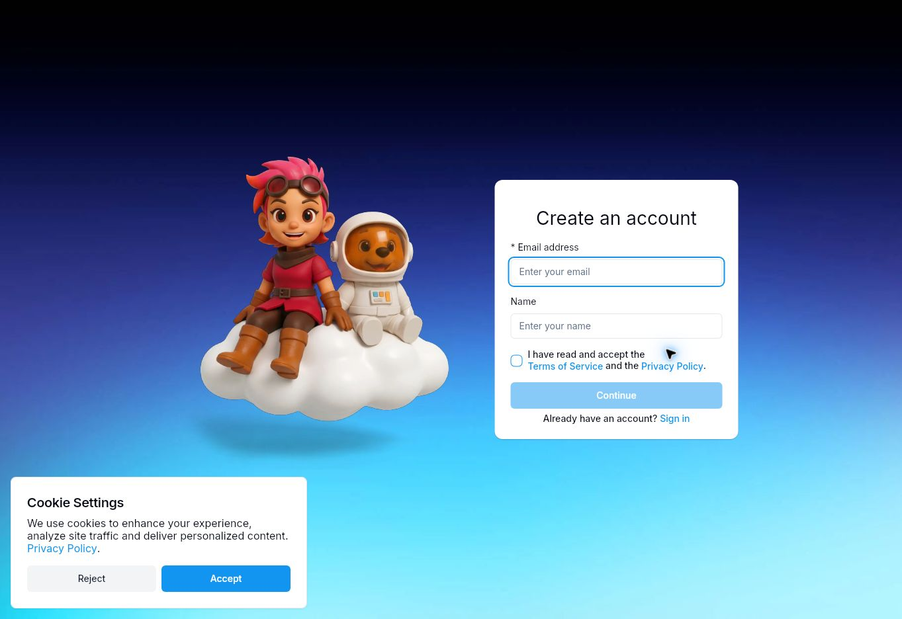
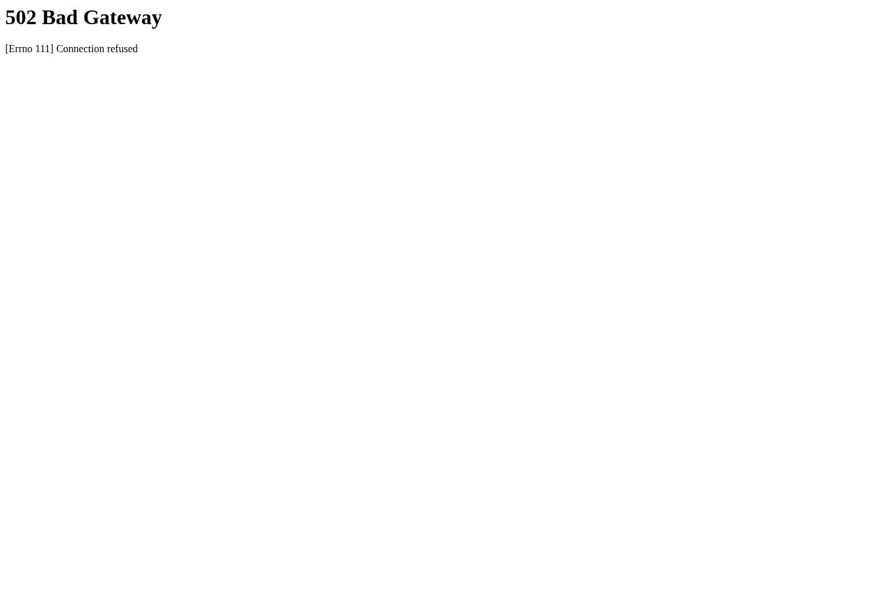

# Actual setup screenshots

Captured on 2026-10-02 from the real Cloud Browser session. These are not generated images.

- `rememberby-preview.jpg`: the independently generated demo rendered through a private Codespaces preview. Shows the email sign-up screen and Launch button; it is not a logged-in or deployed app.
- `serverpod-signup.jpg`: the actual Serverpod Cloud Create an account page. The demo Launch button was exercised and opened this URL in a new tab.
- `google-signin-rough-edge.jpg`: Google OAuth for the original private launch attempt returned 502 / Connection refused before account selection. Deployment did not start.

